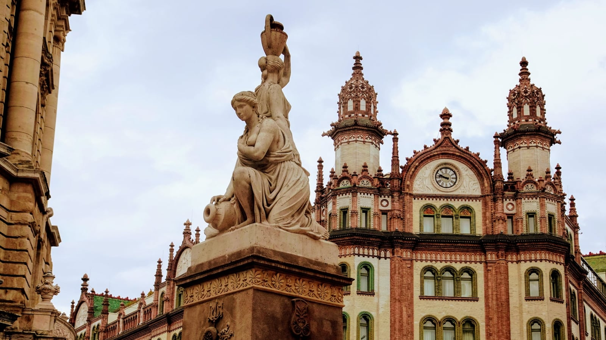
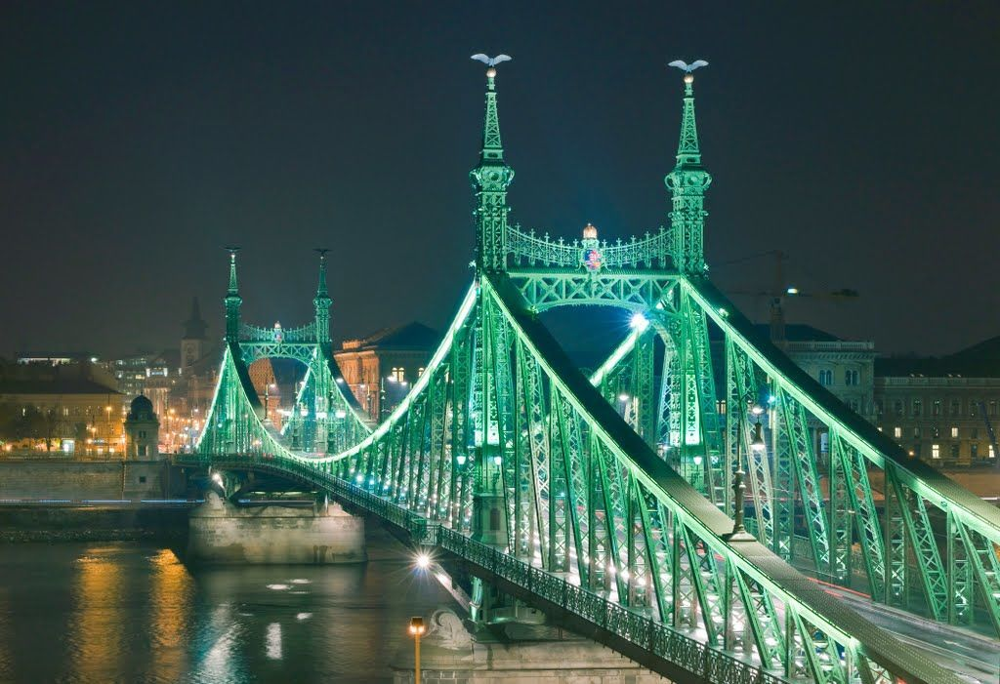

# Mátyás-templom

A Budavári Nagyboldogasszony‑templom, ismertebb nevén Mátyás‑templom, Budapest történelmi Várnegyedének egyik legjelentősebb műemléke. Eredetileg a középkorban alapították, később gótikus stílusban épült és a 19. században restaurálták. Számos koronázás, királyi esküvő és történelmi esemény helyszíne volt, ma kulturális és vallási központ, valamint népszerű turisztikai látnivaló. A templom gyönyörű homlokzatát és mozaikos tetőzetét világszerte ismerik

[Mátyás-templomm hivatalos oldal](https://matyas-templom.hu/en/)

# Nereidák kútja

A Nereidák kútja (más néven Najádok kútja) Budapest V. kerületének, a Ferenciek terén található klasszicista díszkút, amelyet Uhrl Ferenc szobrászművész és Fessl József kőfaragó készítette 1835‑ben. Az alkotás két görög mitológiai vízinimfát, a néréidákat ábrázolja, akik a kutak és vizek gondozói. A szobor az első, szobrászati díszítésű pesti közkút volt, mely a 20. században elpusztult, majd újrafaragott változatban 1976‑ban tért vissza eredeti helyére, így ma is a város egyik jellegzetes műemléke.

[Nereidák kútja hivatalos oldal](https://hu.wikipedia.org/wiki/Nereid%C3%A1k_k%C3%BAtja?)

# Vajdahunyad Vár

1896-ban Magyarország ezredik évfordulója ünneplésére épült Vajdahunyad vára Alpár Ignác által, eredetileg ideiglenes építményként épült fából és kartonból. Népszerűsége és jelentősége miatt Ujraépítették tartósabb anyagokból mint kő és tégla, így állandó tisztelgéssé vált a nemzet építészeti történelme előtt.A Vajdahunyad Vár 21 épület másolatát,tulajdonságait tartalmazza, amelyek a magyar építészet különböző korszakait és stílusait szimbolizálják. A Városligetben található, egy kis tó partján, amely nyáron csónakázni is lehet rajta, télen pedig korcsolyapályává alakul.

[Vajdahunyad Vár hivatalos oldal](https://www.budapest.city/attractions/vajdahunyad-castle/)

# George Washington szobor

(1906-ban leplezték le ott, ahol ma is áll: a városligeti tó partján.) 
 A Washington-szobor előzményéhez az tartozik, hogy az Amerikába kivándorolt magyarok 1902-ben Clevelandben Kossuth-szobrot állítottak, majd mozgalmat indítottak, hogy Washingtonnak is legyen szobra Budapesten.
Ez a szobor lett *Bezerédi főműve* és Budapest újabb szobrainak a legkülönbje.(1906) szeptember 16-án avatták fel, a régi források úgy fogalmaztak, hogy a Stefánia úton. Ez megtévesztő, mert a felavatás idején Stefánia útnak hívták a Ligeten a Hősök teréig átvezető, ma Olof Palme sétánynak nevezett útszakaszt is.

[George Washington szobor oldal](https://www.kozterkep.hu/1511/george-washington-szobra)

# Halászbástya

A Halászbástya (németül: Fischerbastei) Budapest egyik legismertebb műemléke, amely a budai várban, Budapest I. kerületében található.
A Halászok bástyája elnevezést vagy a budai városfalnak a halászok céhe őrizetére bízott szakaszáról kapta vagy pedig hogy az alatta elterülő városrészről, a Halászvárosról. A Várhegy az Árpád-házi királyok idejében szálláshelyként és védelmi beépítésként szolgált, majd késöbb IV Béla városfejlesztése nyomán vált jelentősebbé. Majd késöbb a törökök nyomán érkező osztrák erők pedig Bécsből kormányoztak, ahol már az új divat, a barokk művészet volt aminek a Halászbástya is áldozata lett(a mátyás Templommal együtt).

[Halászbástya oldal](https://hu.wikipedia.org/wiki/Hal%C3%A1szb%C3%A1stya)

# Dohány utcai zsinagóga

A Dohány utcai zsinagóga(Nagy zsinagóga) a magyar neológ zsidóság legnagyobb zsinagógája, illetve a legnagyobb egész Európában. Az egykori zsidónegyedben áll, ahol ma is sok zsidó vallású ember él, akik a hagyományokat mindmáig őrzik.
A zsinagóga építésére (másfél évszázaddal ezelőtt) pályázatot írtak ki, amelyre a kor legjelesebb mérnökei, (mint pl: Hild József) szerepeltek. Végül Ludwig Förster(1797–1863 osztrák építész), a bécsi akadémia tanára nyerte el a pályázatot mór stílusú zsinagógatervével. Majd öt év alatt megépítette ami rekord időnek számított (1991-1996 felújjítással együtt is)

[Dohány utcai zsinagóga hivatalos oldal](https://dohany-zsinagoga.hu/)
[Source](https://hu.wikipedia.org/wiki/Doh%C3%A1ny_utcai_zsinag%C3%B3ga)

# Szabadsághíd

A szabadsághíd másik nevén Ferenc József híd 1894-be lett építve miután 1870 és 1896 között több mint megkétszereződött a főváros lakossága,rohamos ütemben épült a város, nagy arányban fejlődött az ipar, a közlekedés és a kereskedelem, szóval az újabb hidak építése már elkerülhetetlenné vált. A hatóságok két új híd építését határozták el, Erzsébet hidat az Eskü térnél, és a másikat, amelyet később az uralkodóról, Ferenc Józsefről neveztek el. A híd ünnepélyes átadására az uralkodó jelenlétében került sor – ő ütötte be az utolsó ezüstszegecset. 1945. január 16-ána németek felrobbantották majd 1946. augusztus 20-án felújjították és ott kapta a szabadság híd nevet

[Szabadság híd oldal](http://hidak.bparchiv.hu/07_Szabadsag_hid/szabadsaghid.html)

# Parlament (országház)
Az Országház elrendezése teljesen szimmetrikus, és építésének feltétele volt, hogy kizárólag hazai építőanyagokat használjanak fel.
Az, hogy a magyar országgyűlés saját épületet kapjon, már a 19. század első felében felmerült, mivel Pozsony után hol a Pesti Vigadóban, hol a Nemzeti Múzeumban gyűlésezett. Építése 1865-ben kezdődött el Ybl Miklós tervei alapján a mai Bródy Sándor utcában. Alig tizenegy hónap alatt készült el az épület(ideiglenes), amelyben ma a Budapesti Olasz Kultúrintézet működik. majd Az állandó épület tervpályáztatására tizenöt évvel később, 1880-ban került sor.
Az építkezés 1885-től 1904-ig tartott,(tervező az épület teljes befejezését már nem élhette meg).
az építkezés során tizenhét éven keresztül átlagosan ezer ember dolgozott, 176 000 köbméternyi földet mozgattak meg; 40 millió téglát, félmillió díszkövet, 40 kg aranyat használtak fel.

[országház hivatalos oldal](https://www.parlament.hu/web/orszaghaz)
[source](https://hu.wikipedia.org/wiki/Orsz%C3%A1gh%C3%A1z)