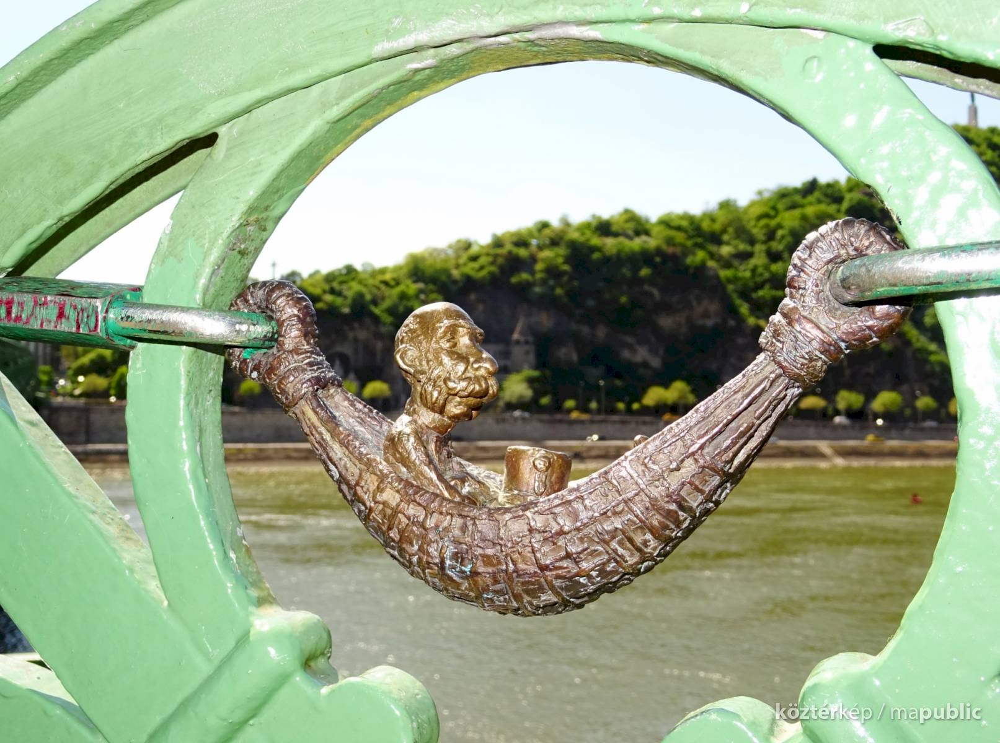
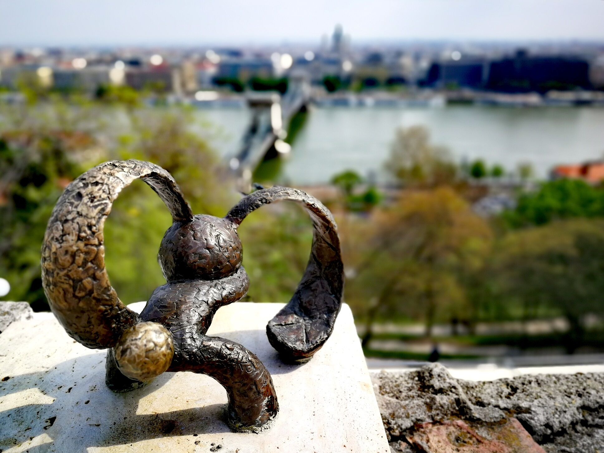
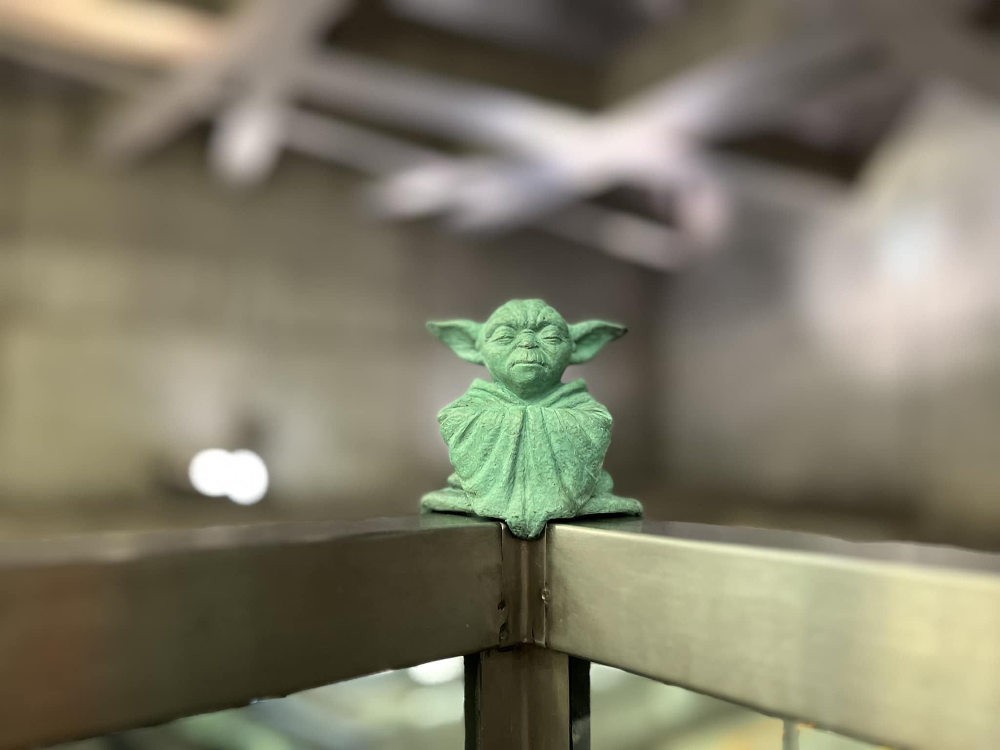

# Herzl Tivadar miniszobor

A Herzl Tivadar-szobor egy művészeti alkotás, amely Kolodkó Mihály miniszobrai közé sorolható. Ezek a kisméretű alkotások gyakran hétköznapi környezetben jelennek meg, váratlan helyeken, mosolyt csalva az arra járók arcára. Kolodkó szobrai mára Budapest különleges és egyedi városi elemeivé váltak, amelyek játékosan vonják be a nézőt a városi tér felfedezésébe.

A szobor alkotója, Kolodkó Mihály különösen érdekes helyszínt választott Herzl Tivadar miniszobrának: egy zebra melletti villanyoszlop tetején kapott helyet, a Dohány utcai zsinagóga közelében. Ez a választás nem véletlen, hiszen a szobor a zsidó állam megálmodóját ábrázolja, ráadásul Herzl Tivadar ebben a környékben született. A figura egy biciklire támaszkodik, ami emberközelivé teszi az ábrázolást, és eltér a hagyományos, monumentális emlékművek merevségétől.

A miniszobor Herzl Tivadar szülőházát jelöli, ugyanakkor ennél többet is nyújt: finoman emlékezteti az arra járókat Herzl írói, politikai és eszmei munkásságára. A szobor csendes jelenléte nem tolakodó, mégis gondolkodásra késztet, és így méltó módon illeszkedik Kolodkó Mihály városi emlékezetet formáló alkotásai közé.

**Források:**
* National Geographic – „Herzl Tivadar miniszobor”
* Aktív Kalandor – Herzl Tivadar – Kolodko miniszobor
* Szallas.hu – „Kolodko: Herzl Tivadar miniszobor” háttérsztori
* JustBudapest – Mihály Kolodko miniszobrai felsorolása
* ChatGPT 5.2 - Prompt: "Egészítsd ki ezt a Kolodkó Mihály Herzl Tivadar miniszobráról készült szöveget"

# Drakula miniszobor 

A Kolodkó Mihály által készített Drakula miniszobor Budapesten, a Vajdahunyad várában található. Az apró bronzszobor a világhírű Lugosi Bélát ábrázolja, aki magyar származású színész volt, majd később amerikai állampolgárrá vált. Lugosi Béla leginkább az 1931-es Drakula gróf című film főszereplőjeként vált ismertté, ahol alakítása máig meghatározza a vámpírfiguráról alkotott képet.

Kolodkó Mihály Lugosi Béla ikonikus színészi jelenléte és a film kultúrtörténeti jelentősége előtt tiszteleg ezzel a miniszoborral. Az alkotás Kolodkóra jellemző módon nem monumentális, hanem rejtett, felfedezésre váró mű, amely játékosan illeszkedik a városi környezetbe. A Vajdahunyad vára különösen találó helyszín, hiszen középkorias hangulata jól kapcsolódik a Drakula-mítosz világához. A szobor egyszerre emlékeztet a magyar kulturális örökség nemzetközi hatására és Lugosi Béla maradandó filmes örökségére.

**Források:**
* TripAdvisor – Kolodko: Drakula miniszobor
* BudapestFlow – Hidden mini statues of Budapest
* Budapest Info – Miniature statues in Budapest (angol)
* TravelToExist – treasure hunt cikk
* ChatGPT 5.2 - Prompt: "Egészítsd ki ezt a Kolodkó Mihály Drakula miniszobráról készült szöveget"

# Lisa Simpson miniszobor 

A Lisa Simpson miniszobor a Jászai Mari téren, a 2-es villamos megállója közelében található, és a magyar szobrász, Kolodkó Mihály alkotása. A kis méretű szobor különlegessége, hogy egy villanyoszlophoz van felkötözve, ami az eredeti sorozat egy jelenetére utal, amikor Lisa egy történelmi alak, Jeanne d’Arc szerepében tűnik fel.  

A szobor elhelyezése és rögzítési módja így játékosan idézi fel a rajzfilm karakterének történetét, ugyanakkor fizikai és vizuális értelemben is a városi környezet részévé válik, hiszen a villamosmegálló és a közlekedési oszlop mindennapi térben helyezi el a műalkotást.  

A bronzszobor aprólékos kidolgozottsága és a karakter jellegzetes arckifejezése révén könnyen felismerhető, és egyfajta humoros, interaktív élményt nyújt a járókelőknek.  

A műalkotás nemcsak a rajzfilmsorozat rajongóinak jelent nosztalgikus élményt, hanem a városi művészet iránt érdeklődőknek is lehetőséget ad, hogy játékosan közelítsenek a szobrászati alkotásokhoz, miközben a hétköznapi térben váratlan találkozásként jelenik meg a művészet.

**Források:**
* National Geographic – „Herzl Tivadar miniszobor”
* Aktív Kalandor – Herzl Tivadar – Kolodko miniszobor
* Szallas.hu – „Kolodko: Herzl Tivadar miniszobor” háttérsztori
* JustBudapest – Mihály Kolodko miniszobrai felsorolása
* ChatGPT 5.2 - Prompt: "Egészítsd ki ezt a Kolodkó Mihály Lisa Simpson miniszobráról készült szöveget"

# Rubik-kocka miniszobor

A Rubik-kocka miniszobor egy Kolodkó Mihály által készített “gerillaszobor”, amely a Batthyány téren, közvetlenül a parlamenttel szemben található. A szobor elhelyezése különösen jelentős, hiszen Rubik Ernő, a világhírű Rubik-kocka feltalálója, a Dunában úszó kövekről merített inspirációt a kocka forgó mechanikájához. 

Így a miniszobor nem csupán egy híres magyar találmány előtt tiszteleg, hanem annak kreatív születését is szimbolizálja, utalva a természet és az ötletesség kapcsolatára. A bronzból készült kis szobor aprólékos kidolgozottsága révén a Rubik-kocka ikonikus alakját jeleníti meg, miközben a városi térben váratlan és játékos élményt nyújt a járókelőknek. 

A “gerillaszobor” jelleg, vagyis az, hogy kicsi és spontánnak tűnik a városi környezetben, fokozza a látogatás élményét: a műalkotás egyszerre tiszteletadás a magyar innovációnak és szórakoztató találkozás a kortárs városi művészettel. A miniszobor így a Rubik-kocka kultikus státuszát és a magyar találékonyságot ünnepli a közterek egyik legforgalmasabb pontján.

**Források:**
* National Geographic – „Herzl Tivadar miniszobor”
* Aktív Kalandor – Herzl Tivadar – Kolodko miniszobor
* Szallas.hu – „Kolodko: Herzl Tivadar miniszobor” háttérsztori
* JustBudapest – Mihály Kolodko miniszobrai felsorolása
* ChatGPT 5.2 - Prompt: "Egészítsd ki ezt a Kolodkó Mihály Rubik-kocka miniszobráról készült szöveget"

# Főkukac miniszobor

A Főkukac miniszobor Budapest egyik különleges, kicsiny, de annál emlékezetesebb köztéri alkotása, amely a Bem rakparton található, a Duna-parti sétányon. A miniszobrot Kolodko Mihály kárpátaljai származású, ma Magyarországon élő szobrászművész készítette és helyezte el a közterületen. Kolodko munkásságát elsősorban gerillaszobrok jellemzik: apró méretű, bronzból készült figurákat rejt el a város különböző pontjain, gyakran váratlan, felfedezésre csábító helyeken. 

A Főkukac szobra egy népszerű gyermekrajzfilm-karaktert idéz meg: A nagy ho-ho-ho horgász című sorozat egyik figuráját, a vidám kis kukacot, aki eredetileg a horgászat csalija volt, ám a szoborban mintha egy pillanatra megállna a város forgatagában és a Dunát figyelné. A műalkotás így nemcsak egy rajzfilm-emléket hordoz, hanem a gyermekkori nosztalgia és a városi tér játékosságának találkozását is reprezentálja. 

A szobor mérete ellenére nagy hatást gyakorol a járókelőkre: mivel alig néhány tizedméteres, a felfedezése valódi kis „kincskereséssé” válik. Sok látogató éppen ezért szentel energiát annak, hogy ráleljen a rejtett alkotásra, ami a hagyományos, nagyszabású köztéri művészetektől eltérő élményt nyújt. Ez a felfedezés öröme szerves része a mű jelentésének és élményének. 

Kolodko miniszobrai – köztük a Főkukac – a budapesti városi kultúra modern arcát képviselik: miközben aprók, karakterük és elhelyezkedésük révén erős érzelmi hatást váltanak ki. Ezek az alkotások gyakran humorosak, meghökkentők vagy éppen nosztalgikusak, és ösztönzik a látogatót arra, hogy újra felfedezze a megszokott városi tereket. A Főkukac különös helyet foglal el ebben a sorozatban, mivel gyakran emlékezteti a felnőtteket gyermekkori élményeikre, és mosolyt csal az arra járók arcára. 

A szobor nem hivatalos, gerilla jellegű alkotás: nem volt nagy avatási ceremónia vagy hivatalos kihelyezés, hanem a művész titokban helyezte el azt a városban, ezzel is növelve a felfedezés örömét és személyes kapcsolatát az utcai művészettel. Ez a megközelítés egyfajta vállalás: a mű a mindennapi városi élet részévé válik, nem pedig egy kijelölt múzeumi térbe zárt tárgyként létezik. 

**Források:**
* Miniszobrok nyomában – Coloré cikk, Kolodko és a Főkukac Budapesten (Coloré)
* Főkukac – Kolodko miniszobor bemutatása (Aktív Kalandor)
* Turista Magazin – Kolodko-miniszobrok, köztük a Főkukac jelentősége (MTSZ)
* Magyar Nemzet – Miniszobrok nyomában Budán – fedezd fel a fővárost (Magyar Nemzet)
* ChatGPT 5.2 - "Egészítsd ki a már meglévő, kb. 2000 karakteres ismertetőt a Főkukac miniszoborról további magyarázatokkal és pontosításokkal."

! [Főkukac-miniszobor](image-16.png)

# Ferenc József miniszobor

A Ferenc József-miniszobor Kolodko Mihály egyik legismertebb és legbeszédesebb alkotása, amely Budapesten, a Szabadság híd pesti hídfőjénél található. A kis méretű bronzszobor az Osztrák–Magyar Monarchia uralkodóját, I. Ferenc Józsefet ábrázolja, aki 1848 és 1916 között állt a birodalom élén. Kolodko sajátos stílusára jellemző módon a szobor nem monumentális emlékműként jelenik meg, hanem ironikus, elgondolkodtató miniszoborként, amely új megvilágításba helyezi a történelmi alakot.

A szobor különlegessége, hogy Ferenc József egy apró, kissé esetlen figuraként jelenik meg, kezében a koronával. Ez az ábrázolásmód tudatos művészi döntés: Kolodko gyakran reflektál a történelemre finom iróniával, és emberközelivé teszi azokat az alakokat, akiket a hagyományos szobrászat hatalmas, tekintélyt sugárzó formában ábrázol. A koronát tartó uralkodó egyszerre utal a hatalomra és annak törékenységére, valamint a magyar történelem ellentmondásos korszakaira.

A miniszobor történelmi utalásrendszere összetett. Ferenc József személye Magyarországon megosztó: uralkodása alatt zajlott az 1848–49-es szabadságharc leverése, ugyanakkor a kiegyezés (1867) révén hosszú időre stabilitást és fejlődést hozott az ország számára. Kolodko alkotása nem ítélkezik nyíltan, hanem kérdéseket vet fel: hogyan viszonyulunk ma a múlt nagy alakjaihoz, és miként értelmezzük újra a történelmet a jelen szemszögéből.

A szobor elhelyezése sem véletlen. A Szabadság híd önmagában is erős szimbolikus jelentéssel bír, így a miniszobor környezete tovább erősíti a mű üzenetét. A járókelők gyakran véletlenül fedezik fel az apró alkotást, ami Kolodko művészetének egyik alapelve: a felfedezés élménye személyes kapcsolatot teremt a néző és a mű között.

Összességében a Kolodko-féle Ferenc József-miniszobor nem csupán egy történelmi figura ábrázolása, hanem gondolatébresztő köztéri alkotás, amely humorral és iróniával segít újragondolni a múltat, és hozzájárul Budapest modern városi kulturális arculatához

**Források:**
* Köztérkép.hu – Ferenc József (Kolodko Mihály miniszobra)
* ErreArra.org – Kolodko Mihály: Ferenc József miniszobor a Szabadság hídnál
* Fidelio.hu – Kolodko Mihály: irónia és történelem a köztéri miniszobrokban
* Pestbuda.hu – Kolodko Mihály budapesti miniszobrai és történelmi utalásaik
* ChatGPT 5.2 - "Egészítsd ki a meglévő ismertetőt a Kolodko Mihály által készített Ferenc József-miniszoborról úgy, hogy részletesebb legyen a szobor története és jelentősége."

# Kockásfülü nyúl miniszobor

A Kockásfülű nyúl miniszobor (Kolodko Mihály) – története és jelentősége

A Kockásfülű nyúl miniszobor Kolodko Mihály egyik legkedveltebb budapesti alkotása, amely a Bem rakpart környékén, a Duna közelében található. A kis méretű bronzszobor a magyar animációtörténet egyik ikonikus figuráját, a Kockásfülű nyulat ábrázolja, aki a hetvenes–nyolcvanas években vetített, azonos című rajzfilmsorozat főszereplője volt. A karakter generációk számára vált meghatározóvá, hiszen különleges képességeivel – például hosszú, kockás füleivel – mindig segített a bajba jutott gyerekeken.

Kolodko Mihály gerillaszobrászati stílusához hűen ezt az alkotást is engedély nélkül, meglepetésszerűen helyezte el a városi térben. A szobor nem monumentális formában idézi meg a figurát, hanem apró, játékos megjelenéssel, amely felfedezésre ösztönzi a járókelőket. Ez a megközelítés tudatos művészi döntés: Kolodko célja, hogy a néző ne csak szemlélője, hanem aktív felfedezője legyen a városi művészetnek.

A Kockásfülű nyúl miniszobor erős nosztalgikus töltettel bír. A rajzfilm a magyar televíziózás aranykorát idézi, így a szobor elsősorban a felnőtteket szólítja meg, akik saját gyerekkoruk emlékeivel találkoznak újra. Ugyanakkor a fiatalabb generációk számára is figyelemfelkeltő, hiszen a karakter barátságos és játékos megjelenése könnyen szerethetővé teszi.

A szobor jelentősége túlmutat önmagán: része annak a miniszobor-hálózatnak, amely Budapestet egyfajta szabadtéri, interaktív kiállítótérré alakítja. A Kockásfülű nyúl Kolodko más alkotásaihoz hasonlóan arra ösztönzi az embereket, hogy más szemmel nézzenek a városra, és észrevegyék az apró részletekben rejlő értékeket. Az alkotás egyszerre tisztelgés a magyar rajzfilmkultúra előtt és modern városi művészeti állásfoglalás.

Összességében a Kockásfülű nyúl miniszobor egy szerethető, gondolatébresztő köztéri alkotás, amely a humor, a nosztalgia és a felfedezés élményén keresztül járul hozzá Budapest kulturális arculatához

**Források:**
* Szoborlap.hu – Kockásfülű nyúl miniszobra (Kolodko Mihály)
* Köztérkép.hu – Kolodko Mihály: Kockásfülű nyú
* Fidelio.hu – Kolodko Mihály miniszobrai és jelentésük
* Pestbuda.hu – Budapesti miniszobrok nyomában – Kolodko Mihály alkotásai
* ChatGPT 5.2 - "Egészítsd ki a meglévő ismertetőt a Kolodko Mihály Kockásfülű nyúl-miniszoboráról, hogy részletesebben bemutassa a történetét és jelentőségét"

# Yoda mester szobra

Yoda mester miniszobor (Kolodko Mihály) – története és jelentősége

A Yoda mester miniszobor Kolodko Mihály egyik legkülönlegesebb és legfrissebb budapesti alkotása, amely a 4‑es metró Szent Gellért téri állomásánál bukkant fel 2024 augusztusában. Az apró bronzszobor a „Csillagok háborúja” (Star Wars) filmsorozat egyik legismertebb karakterét, Yodát, a bölcs Jedi mestert ábrázolja, aki a filmekben a békességet, a tudást és a belső erőt jelképezi. 
hvg.hu
+1

Kolodko Mihály köztudottan olyan apró miniszobrokat készít, amelyeket gerilla módon helyez el a város közterein, így váratlan találkozást és felfedezési élményt nyújtva a járókelők számára. A Yoda‑szobor sem kivétel: a mozgólépcső melletti korlátra ültetve az alkotás mintha a metróba tartókat figyelné, vagy épp gondolkodna a városi forgatag felett. 
Köztérkép

A választás, hogy épp Yodát formázza meg, több szempontból is érdekes. Yoda a népszerű kultúra egyik olyan figurája, aki generációkat köt össze: a Star Wars‑rajongó felnőtteket a filmek emlékeivel hozza közelebb, míg a fiatalabbak számára is ismerős és szerethető karakter. Az ilyen popkulturális utalások Kolodko művészetében fontos szerepet játszanak, hiszen nem csupán nosztalgiát ébresztenek, hanem a művészet és a hétköznapi élet közötti határvonalat is elmosva ösztönzik a felfedezést és a párbeszédet. 
hvg.hu

A szobor elhelyezése a metróállomásnál különösen jelentős: ilyen forgalmas helyszínen a miniszobor számos ember számára válik felfedezhetővé, miközben hozzájárul a város kulturális élményéhez. A Kolodko‑alkotások célja – és ezt a Yoda‑mű is tükrözi – az, hogy a városi térben rejtett „kincseket” hozzon létre, amelyek a megszokott útvonalakat izgalmasabbá és személyesebbé teszik. 
Startlap - Hírek, időjárás, információk

Bár Kolodko sokszor engedély nélkül helyezi el műveit, a Yoda‑szobor esetében a Budapesti Közlekedési Központ (BKK) is pozitívan reagált a megjelenésére, sőt saját közösségi média felületén is megosztotta azt, ezzel jelezve, hogy a városi szervezetek is felismerik a mű értékét. 
hvg.hu

Összességében a Yoda mester miniszobor nem csupán egy popkulturális hivatkozás: egy kreatív, felfedezésre ösztönző köztéri műalkotás, amely a budapesti utcákat egy kicsit varázslatosabbá, élménygazdagabbá és közösségibbé teszi. A mű a modern városi művészet sajátos példája, amely egyaránt szól a filmes ikonográfiát értő közönséghez és az egyszerű járókelőhöz is.

**Források:**
* HVG – Yoda mesterről készített miniszobrot Kolodko Mihály a négyes metrónál
* Köztérkép.hu – Yoda (miniszobor), Szent Gellért tér
* Startlap Utazás – Újabb Kolodko‑szobor Budapesten: Yoda mester ügyel a    metrómegálló békéjére
* Újbudai Hírek – Yoda‑miniszobor került a Gellért téri metrómegállóba
* ChatGPT 5.2 - "Egészítsd ki a meglévő ismertetőt a Kolodko Mihály Yoda mester-miniszoborról, hogy bemutassa a történetét, elhelyezkedését és jelentőségét."
