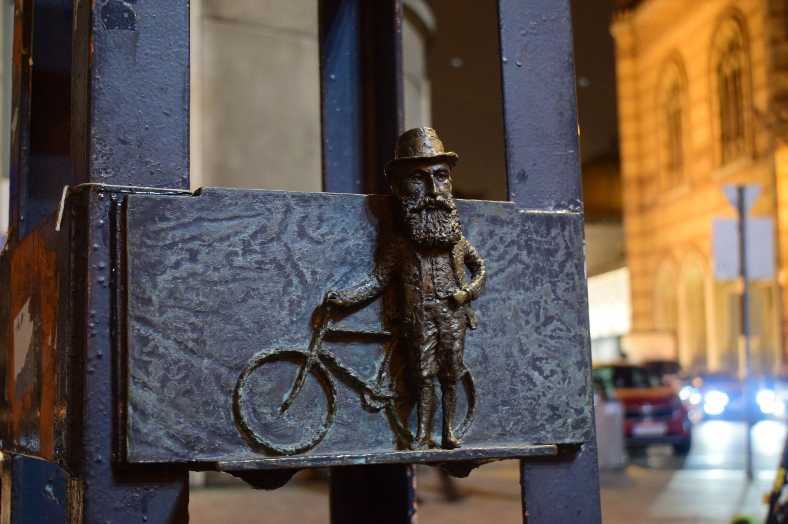
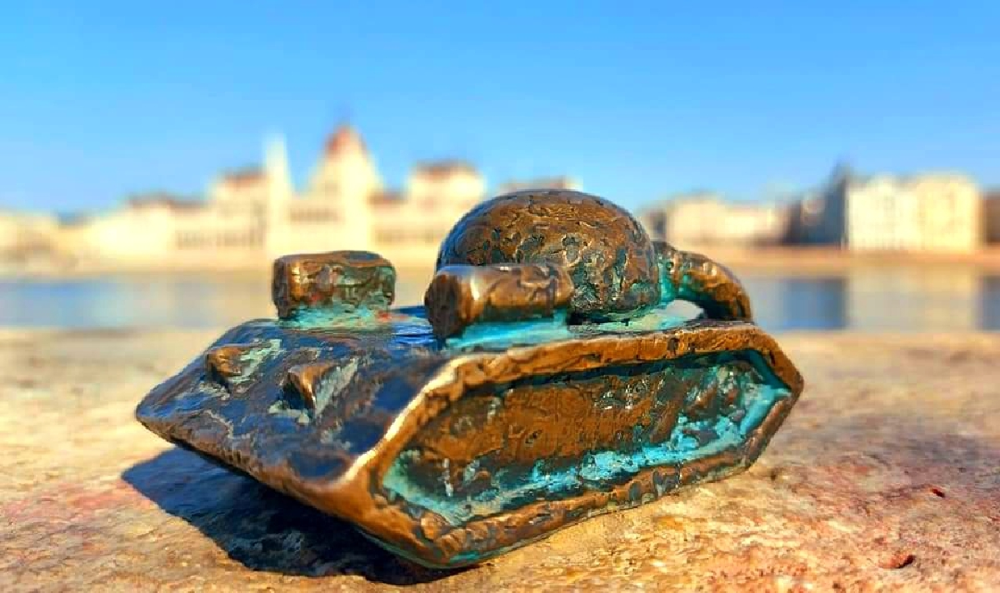
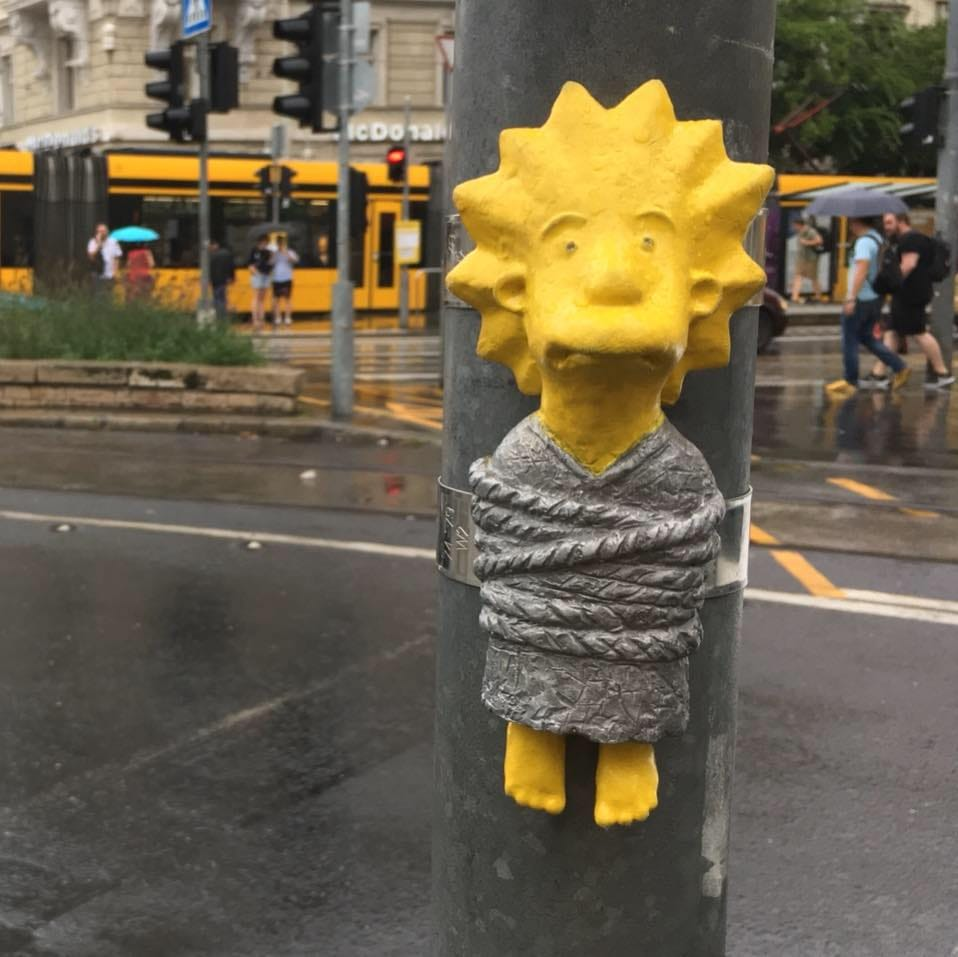
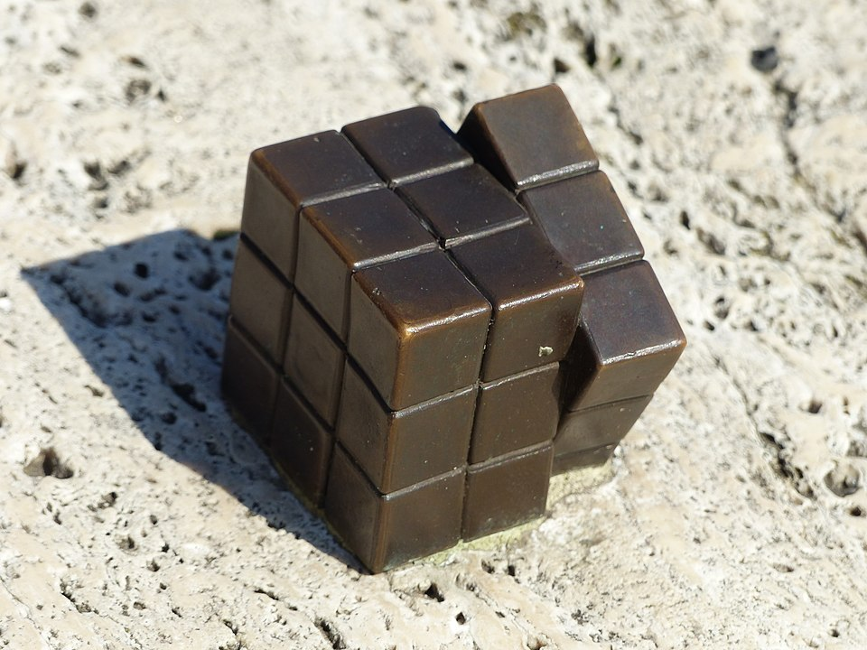

# Herzl Tivadar miniszobor

A Herzl Tivadar-szobor egy művészeti alkotás, amely Kolodkó Mihály miniszobrai közé sorolható. Ezek a kisméretű alkotások gyakran hétköznapi környezetben jelennek meg, váratlan helyeken, mosolyt csalva az arra járók arcára. Kolodkó szobrai mára Budapest különleges és egyedi városi elemeivé váltak, amelyek játékosan vonják be a nézőt a városi tér felfedezésébe.

A szobor alkotója, Kolodkó Mihály különösen érdekes helyszínt választott Herzl Tivadar miniszobrának: egy zebra melletti villanyoszlop tetején kapott helyet, a Dohány utcai zsinagóga közelében. Ez a választás nem véletlen, hiszen a szobor a zsidó állam megálmodóját ábrázolja, ráadásul Herzl Tivadar ebben a környékben született. A figura egy biciklire támaszkodik, ami emberközelivé teszi az ábrázolást, és eltér a hagyományos, monumentális emlékművek merevségétől.

A miniszobor Herzl Tivadar szülőházát jelöli, ugyanakkor ennél többet is nyújt: finoman emlékezteti az arra járókat Herzl írói, politikai és eszmei munkásságára. A szobor csendes jelenléte nem tolakodó, mégis gondolkodásra késztet, és így méltó módon illeszkedik Kolodkó Mihály városi emlékezetet formáló alkotásai közé.

**Források:**
* National Geographic – „Herzl Tivadar miniszobor”
* Aktív Kalandor – Herzl Tivadar – Kolodko miniszobor
* Szallas.hu – „Kolodko: Herzl Tivadar miniszobor” háttérsztori
* JustBudapest – Mihály Kolodko miniszobrai felsorolása
* ChatGPT 5.2 - Prompt: "Egészítsd ki ezt a Kolodkó Mihály Herzl Tivadar miniszobráról készült szöveget"

# Drakula miniszobor 

A Kolodkó Mihály által készített Drakula miniszobor Budapesten, a Vajdahunyad várában található. Az apró bronzszobor a világhírű Lugosi Bélát ábrázolja, aki magyar származású színész volt, majd később amerikai állampolgárrá vált. Lugosi Béla leginkább az 1931-es Drakula gróf című film főszereplőjeként vált ismertté, ahol alakítása máig meghatározza a vámpírfiguráról alkotott képet.

Kolodkó Mihály Lugosi Béla ikonikus színészi jelenléte és a film kultúrtörténeti jelentősége előtt tiszteleg ezzel a miniszoborral. Az alkotás Kolodkóra jellemző módon nem monumentális, hanem rejtett, felfedezésre váró mű, amely játékosan illeszkedik a városi környezetbe. A Vajdahunyad vára különösen találó helyszín, hiszen középkorias hangulata jól kapcsolódik a Drakula-mítosz világához. A szobor egyszerre emlékeztet a magyar kulturális örökség nemzetközi hatására és Lugosi Béla maradandó filmes örökségére.

**Források:**
* TripAdvisor – Kolodko: Drakula miniszobor
* BudapestFlow – Hidden mini statues of Budapest
* Budapest Info – Miniature statues in Budapest (angol)
* TravelToExist – treasure hunt cikk
* ChatGPT 5.2 - Prompt: "Egészítsd ki ezt a Kolodkó Mihály Drakula miniszobráról készült szöveget"

# Lisa Simpson miniszobor 

A Lisa Simpson miniszobor a Jászai Mari téren, a 2-es villamos megállója közelében található, és a magyar szobrász, Kolodkó Mihály alkotása. A kis méretű szobor különlegessége, hogy egy villanyoszlophoz van felkötözve, ami az eredeti sorozat egy jelenetére utal, amikor Lisa egy történelmi alak, Jeanne d’Arc szerepében tűnik fel.  

A szobor elhelyezése és rögzítési módja így játékosan idézi fel a rajzfilm karakterének történetét, ugyanakkor fizikai és vizuális értelemben is a városi környezet részévé válik, hiszen a villamosmegálló és a közlekedési oszlop mindennapi térben helyezi el a műalkotást.  

A bronzszobor aprólékos kidolgozottsága és a karakter jellegzetes arckifejezése révén könnyen felismerhető, és egyfajta humoros, interaktív élményt nyújt a járókelőknek.  

A műalkotás nemcsak a rajzfilmsorozat rajongóinak jelent nosztalgikus élményt, hanem a városi művészet iránt érdeklődőknek is lehetőséget ad, hogy játékosan közelítsenek a szobrászati alkotásokhoz, miközben a hétköznapi térben váratlan találkozásként jelenik meg a művészet.

**Források:**
* National Geographic – „Herzl Tivadar miniszobor”
* Aktív Kalandor – Herzl Tivadar – Kolodko miniszobor
* Szallas.hu – „Kolodko: Herzl Tivadar miniszobor” háttérsztori
* JustBudapest – Mihály Kolodko miniszobrai felsorolása
* ChatGPT 5.2 - Prompt: "Egészítsd ki ezt a Kolodkó Mihály Lisa Simpson miniszobráról készült szöveget"

# Rubik-kocka miniszobor

A Rubik-kocka miniszobor egy Kolodkó Mihály által készített “gerillaszobor”, amely a Batthyány téren, közvetlenül a parlamenttel szemben található. A szobor elhelyezése különösen jelentős, hiszen Rubik Ernő, a világhírű Rubik-kocka feltalálója, a Dunában úszó kövekről merített inspirációt a kocka forgó mechanikájához. 

Így a miniszobor nem csupán egy híres magyar találmány előtt tiszteleg, hanem annak kreatív születését is szimbolizálja, utalva a természet és az ötletesség kapcsolatára. A bronzból készült kis szobor aprólékos kidolgozottsága révén a Rubik-kocka ikonikus alakját jeleníti meg, miközben a városi térben váratlan és játékos élményt nyújt a járókelőknek. 

A “gerillaszobor” jelleg, vagyis az, hogy kicsi és spontánnak tűnik a városi környezetben, fokozza a látogatás élményét: a műalkotás egyszerre tiszteletadás a magyar innovációnak és szórakoztató találkozás a kortárs városi művészettel. A miniszobor így a Rubik-kocka kultikus státuszát és a magyar találékonyságot ünnepli a közterek egyik legforgalmasabb pontján.

**Források:**
* National Geographic – „Herzl Tivadar miniszobor”
* Aktív Kalandor – Herzl Tivadar – Kolodko miniszobor
* Szallas.hu – „Kolodko: Herzl Tivadar miniszobor” háttérsztori
* JustBudapest – Mihály Kolodko miniszobrai felsorolása
* ChatGPT 5.2 - Prompt: "Egészítsd ki ezt a Kolodkó Mihály Rubik-kocka miniszobráról készült szöveget"

